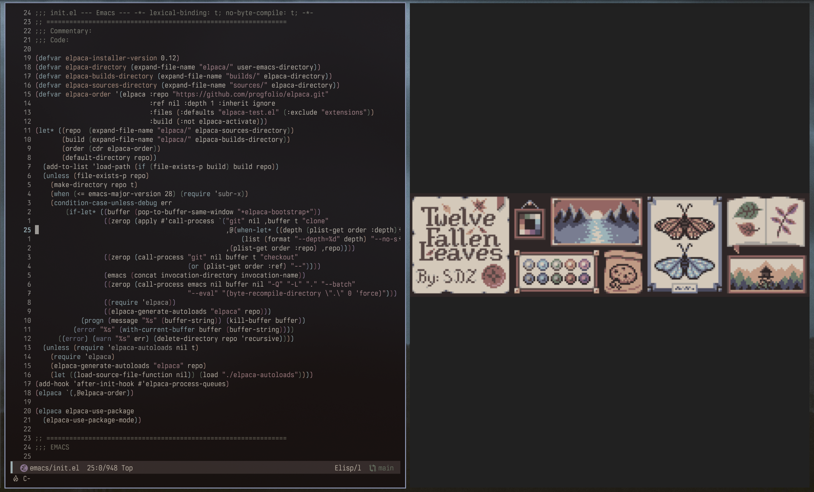
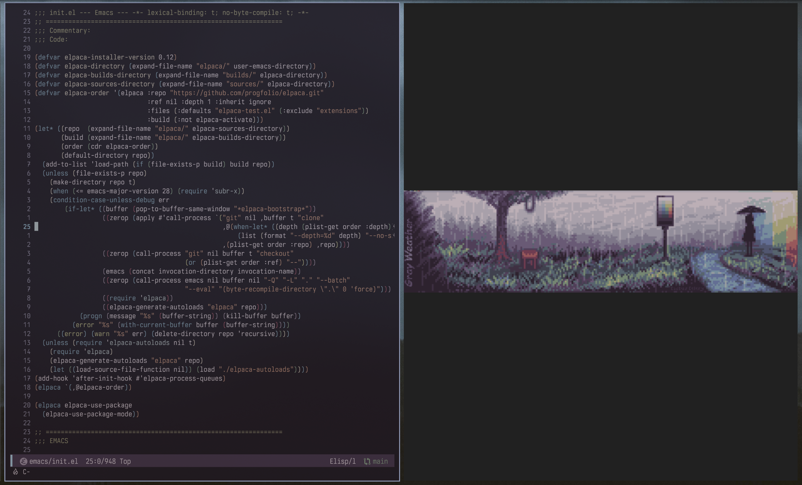
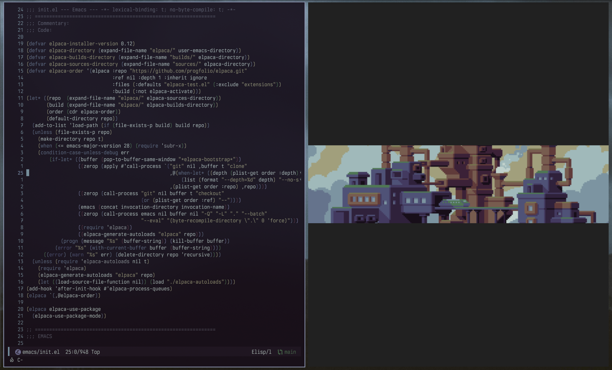
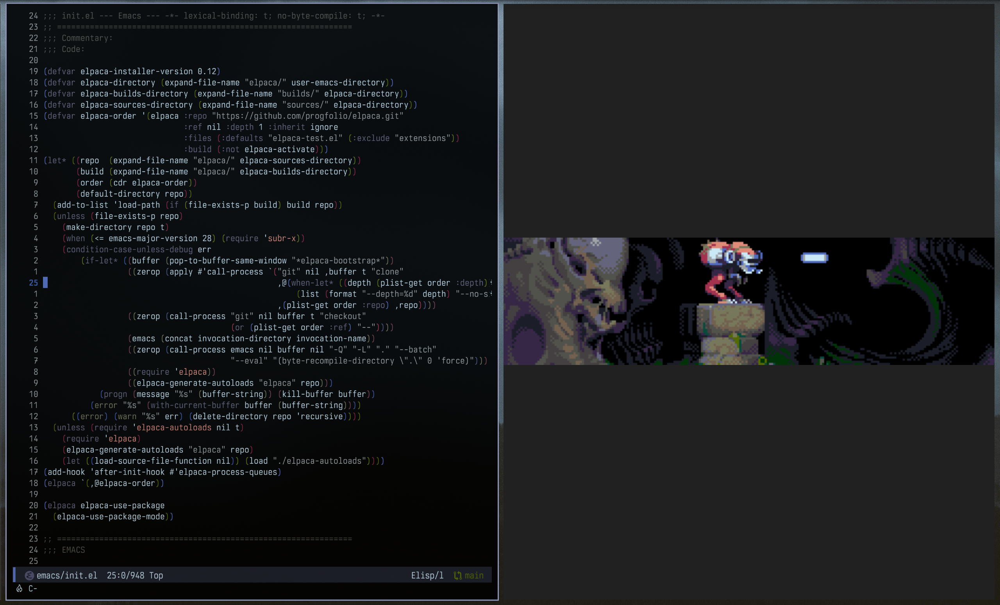
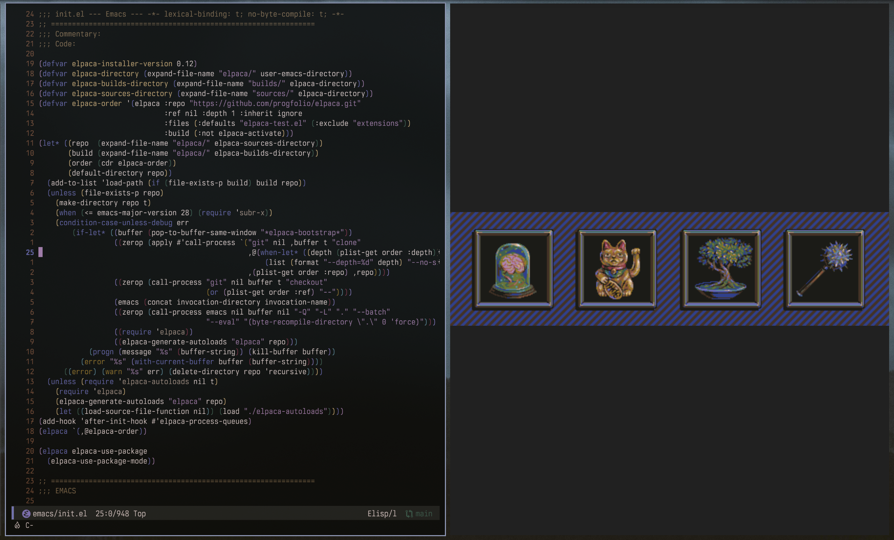
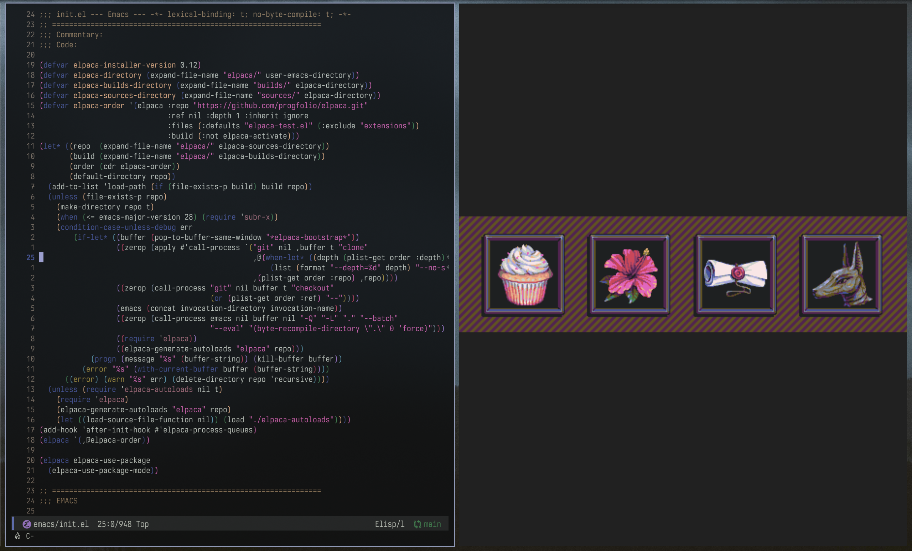

# pixel-themes

Lospec pixel art palettes adapted for Emacs, based on modus-themes.

## Requirements
- Emacs 28.1+
- modus-themes 5.0.0+

## Installation

### Elpaca

```elisp
(use-package pixel-themes
  :ensure (:host github :repo "lucasobx/pixel-themes")
  :config
  (pixel-themes-mode 1)
  (pixel-themes-load-theme 'pixel-themes-miri16))
```

## Usage

`pixel-themes-mode` adds all pixel themes to the standard Modus Themes commands:

- `pixel-themes-rotate` - cycle through themes
- `pixel-themes-select` - pick a theme interactively
- `pixel-themes-load-random-dark` - load a random dark theme
- `pixel-themes-list-colors-current` - inspect the active theme's palette

### Palette overrides

Each theme exposes a customization variable for palette overrides:

```elisp
(setq pixel-themes-alia16-palette-overrides
      '((bg-main "#0a0a0c")
        (comment green-faint)))
```


## Themes

`pixel-themes-fallen-leaves` - [palette](https://lospec.com/palette-list/twelve-fallen-leaves)



`pixel-themes-gray-weather` - [palette](https://lospec.com/palette-list/gray-weather)



`pixel-themes-steam-lords` - [palette](https://lospec.com/palette-list/steam-lords)



`pixel-themes-psygnosia` - [palette](https://lospec.com/palette-list/psygnosia)



`pixel-themes-miri16` - [palette](https://lospec.com/palette-list/miri16)



`pixel-themes-alia16` - [palette](https://lospec.com/palette-list/alia16)



## TODO

- [X] Dark themes
- [ ] Light themes
